# Ergonomie de la navigation — humanome.xyz

> Travail d'architecture de l'information (pas de programmation, sauf le menu burger déjà
> posé §5). Objectif : un « palais mental » de toutes les fonctionnalités, par persona, et
> une réorganisation des **menus** (pas des fonctionnalités) qui allège la charge cognitive.
> Relevé du code sous-jacent : [`architecture-actuelle`](#annexe-relevé-du-code) (voir §6).
>
> Méthode : 8 lentilles-persona (analyse de friction, une par profil) + 3 philosophies
> de réorganisation candidates, générées en parallèle, puis **synthèse en une IA unique**.

---

## 1. Analyse de la complexité

### 1.1 Le principe fondateur : navigation **additive par rôle**

Toute l'IA repose sur un seul mécanisme (`web/src/nav.js`) :

- **« Découvrir »** — famille visible par **tous** (visiteur anonyme compris).
- **« Mon travail »** — famille qui **apparaît** dès qu'un rôle de travail est en session, et
  qui **empile** les entrées de chaque rôle cumulé (dédup par `href`).
- L'en-tête porte toujours, en plus : l'aide contextuelle « ? » et « Mon compte / Se connecter ».

C'est élégant et économe — personne n'est noyé sous des liens qui ne le concernent pas. Mais ce
modèle a **quatre angles morts** qui fabriquent l'essentiel des frictions :

1. `apprenant` est attribué à **tout le monde** → la barre « Mon travail » de n'importe quel rôle
   (cartographe, admin…) est **d'abord** encombrée de 3 entrées d'apprenant avant sa vraie entrée.
2. Deux personas — **employeur** et **épistémiarque** — n'ont **aucune** entrée dédiée, alors
   qu'ils ont des tâches réelles.
3. Le regroupement de 2ᵉ niveau est **hétérogène** : certaines sous-nav sont explicites
   (cartographe, promptologue, admin), d'autres implicites (espace, compte).
4. Les libellés nomment des **rôles** (« Espace cartographe ») ou des **objets techniques**
   (« Lancer un run »), pas des **buts** utilisateur.

### 1.2 Ordres de grandeur

| Mesure | Valeur |
|---|---|
| Vues de 1ᵉʳ niveau | 17 |
| Sous-sections de 2ᵉ niveau | ~25 |
| Entrées barre — visiteur | 5 (Découvrir) + compte + aide |
| Entrées barre — compte cumulé (apprenant+cartographe+promptologue+établissement+admin) | ~13 |
| Familles au niveau 1 | **2** seulement (Découvrir / Mon travail) |
| Personas sans entrée dédiée | **2** (employeur, épistémiarque) |

### 1.3 Carte mentale de l'IA **actuelle** (mindmap)

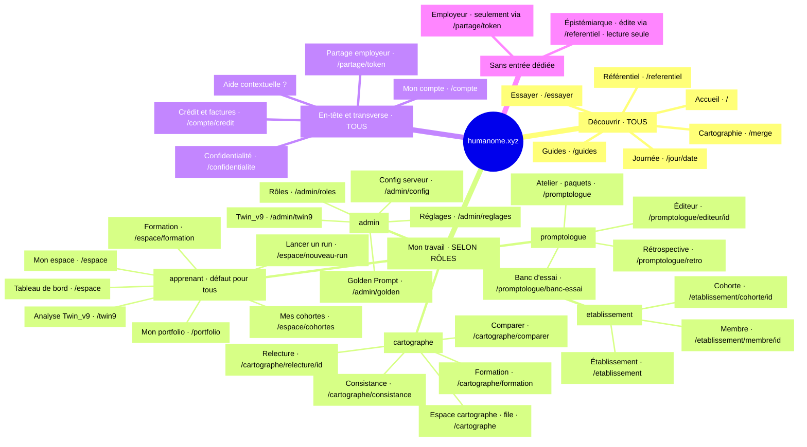

### 1.4 Champ de vision **par persona** (état actuel)

Chaque persona ne « voit » qu'une tranche de l'IA. Voici, pour chaque profil, ce qu'il voit au
niveau 1, sa tâche n°1, sa friction-titre et le verdict « se repère-t-il aujourd'hui ? ».

| Persona | Voit au niveau 1 | Tâche n°1 | Friction-titre | Verdict |
|---|---|---|---|---|
| **Visiteur** | Découvrir (5) + Se connecter | Comprendre en 30 s + essayer sans compte | « Cartographie » ouvre une vue **vide** ; aucune entrée « comprendre » ; « Essayer » ne dit pas *gratuit/sans compte* | ❌ se perd |
| **Apprenant** (cœur de cible) | Découvrir + Mon espace / Mon portfolio / Analyse Twin_v9 + Mon compte | Alimenter le portfolio → cartographier → partager | **Partager sa cartographie n'a aucun domicile de menu** ; 3 portes « cartographier » ; 3 « Mon… » | ❌ |
| **Employeur** | Header générique au-dessus de la vue partagée | Lire une cartographie **garantie**, vite | Tout clic dans le header **démonte** la vue partagée et **redemande le mot de passe** ; sceau de garantie absent/discret | ❌ |
| **Cartographe** | Mon espace/portfolio/Twin_v9 **puis** Espace cartographe (4ᵉ) | Ouvrir sa file, relire, garantir, enchaîner | File **enterrée** en 4ᵉ position, mal nommée ; pas de « valider & suivant » ni de registre de garanties | ⚠️ par tolérance |
| **Promptologue** | idem + Atelier promptologue | Éditer/versionner un paquet, tester A/B | **L'Éditeur n'est pas dans la sous-nav** ; démarrage à froid impossible ; boucle publier/défaut fuit vers l'Admin invisible | ⚠️ en partie |
| **Épistémiarque** | Découvrir + 3 « Mon… » apprenant (rien à lui) | Faire évoluer le référentiel | **Invisible dans l'IA** : aucune entrée ; `/referentiel` est en **lecture seule** ; vrai poste = Decidim, hors-app | ❌ |
| **Établissement** (B2B) | 3 « Mon… » apprenant + Établissement | Surveiller budget + runs de masse, lire membre par membre | **Budget** enfoui dans un formulaire ; run de masse au 3ᵉ niveau ; « Mes cohortes » = sens **inversé** (rejoindre vs gérer) | ⚠️ |
| **Admin** | 3 « Mon… » apprenant + Administration | Rôles, Golden Prompt, réglages, Twin_v9 | Golden Prompt à **deux domiciles** ; collision de nom « Twin_v9 » (analyse conso vs onglet admin) ; gouvernance noyée dans « Mon travail » apprenant | ⚠️ onglets ok, périmètres flous |

Et le « palais mental » proprement dit — **une carte par profil** : ce que chaque persona voit
*aujourd'hui*, ses points de douleur inscrits sur les nœuds (`⚠`/`MANQUE`/`PIÈGE`).

**Visiteur**

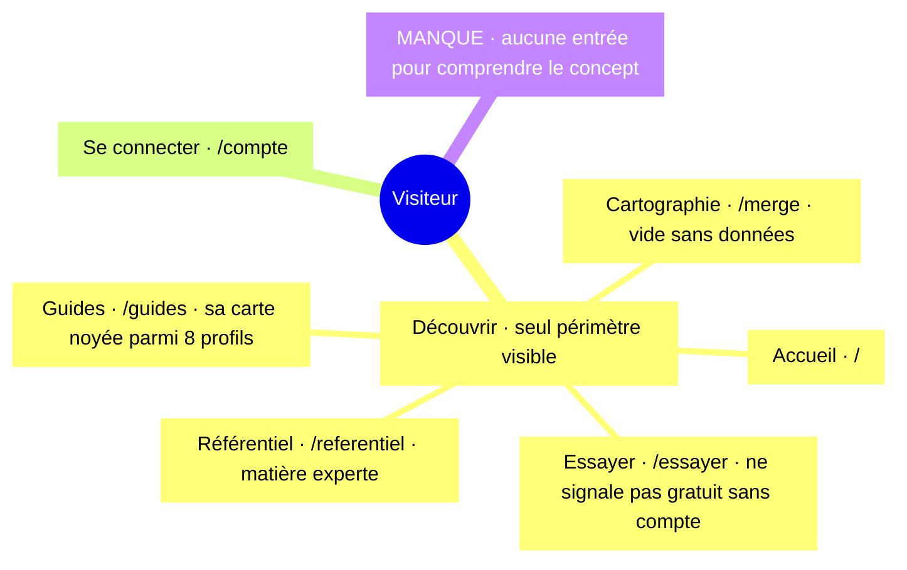

**Apprenant** (cœur de cible)

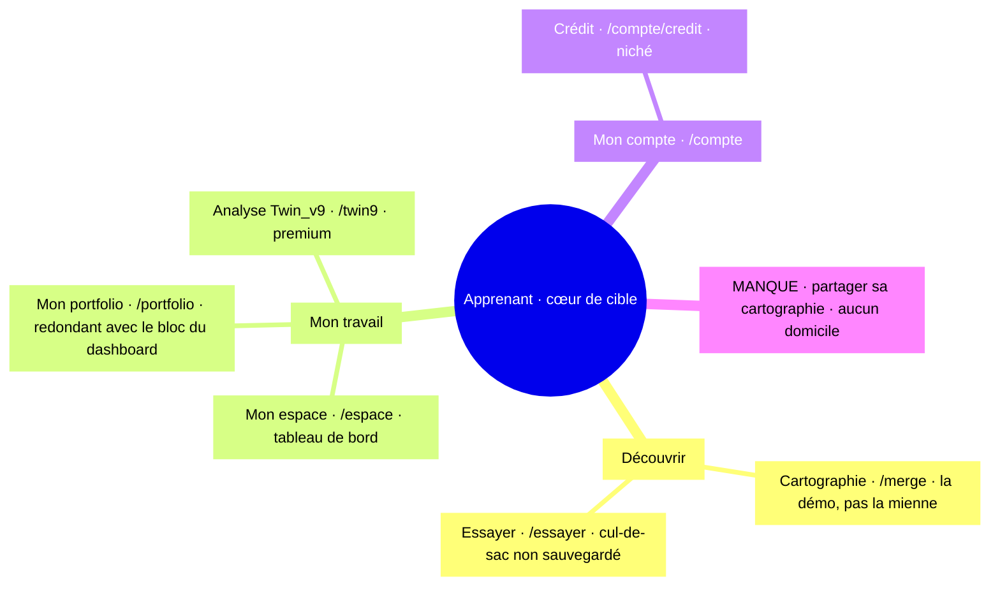

**Employeur / recruteur**

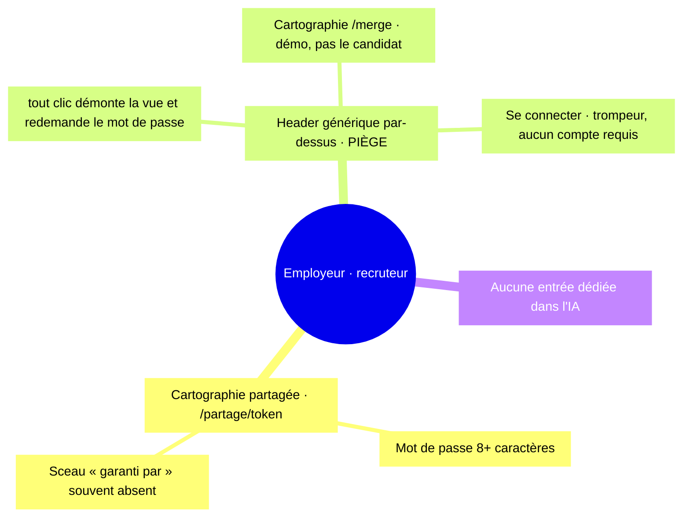

**Cartographe**

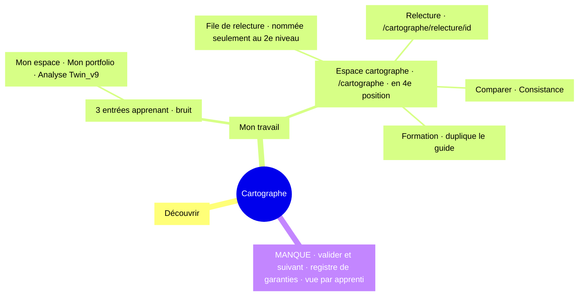

**Promptologue**

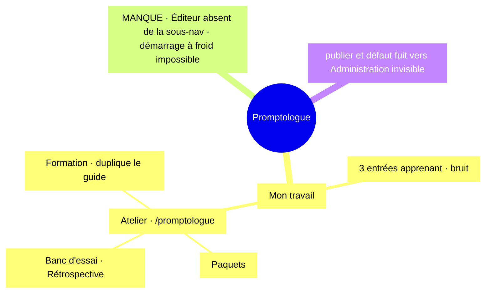

**Épistémiarque**

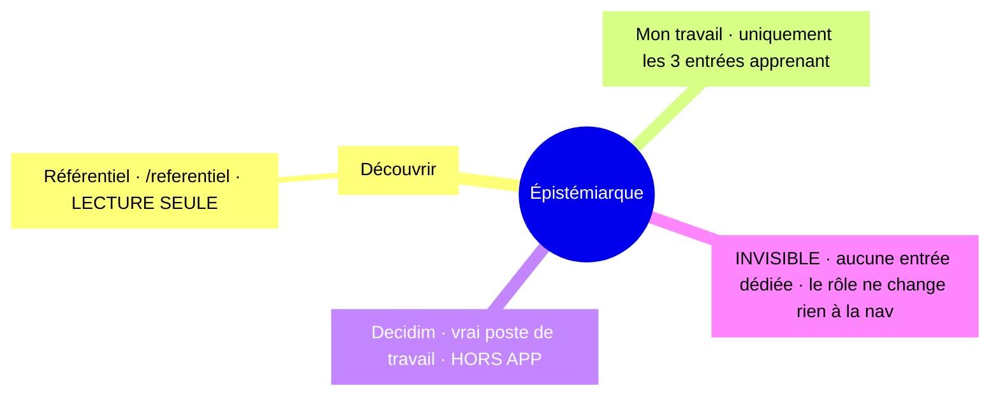

**Établissement** (B2B)

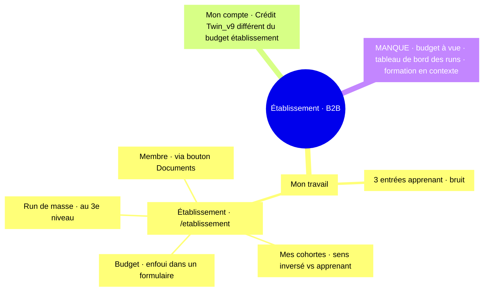

**Admin**

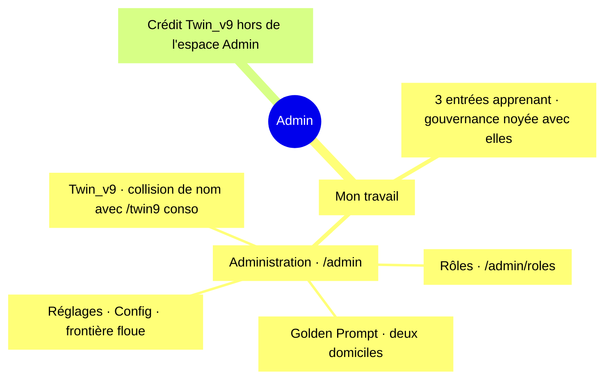

### 1.5 Frictions — les 5 confirmées + les principales découvertes

**Confirmées par lecture du code (le squelette du problème) :**

| # | Friction | Qui elle touche |
|---|---|---|
| 1 | Triple échelle « cartographier mon texte » (Essayer / Lancer un run / Twin_v9), libellés **non alignés sur la valeur** | visiteur, apprenant, promptologue, établissement, admin |
| 2 | **« Mon portfolio »** au niveau 1 alors qu'il est l'**étape d'entrée** d'un run (le tableau de bord l'expose déjà) | apprenant |
| 3 | **« Guides » duplique** les onglets « Formation » internes (même markdown, deux domiciles) | apprenant, cartographe, promptologue, établissement, admin |
| 4 | **Trois « Mon… »** (espace / compte / portfolio) — frontière travail/compte/entrée floue | apprenant, cartographe, établissement |
| 5 | **`/compte/credit`** couplé à Twin_v9 mais **niché** sous le compte | apprenant, promptologue, établissement, admin |

**Découvertes par les lentilles-persona (la chair du problème) :**

- **[HAUTE] Le verbe fondateur de l'apprenant — *partager* sa cartographie — n'a aucun domicile de
  menu.** Le lien + mot de passe est enfoui dans une vue sans entrée.
- **[HAUTE] La vue partagée est un piège d'état pour l'employeur** : tout clic dans le header
  générique (« Cartographie », « Se connecter », logo…) démonte `ShareView` et **redemande le mot
  de passe** au retour. Le seul persona « lecture pure » est puni à chaque clic exploratoire.
- **[HAUTE] Le sceau de garantie** — sa promesse centrale — est aujourd'hui **null** (tant que P9
  n'est pas livré) et, même livré, réduit à une ligne discrète. Pas de repère de confiance saillant.
- **[HAUTE] La boucle de relecture du cartographe est cassée** : pas de « valider & suivant », pas
  de vue **par apprenti**, pas de **registre de garanties** (ce qu'il a certifié).
- **[HAUTE] L'Éditeur du promptologue n'est pas dans la sous-nav** (son outil n°1) ; et le
  **démarrage à froid** est impossible depuis l'UI (créer un brouillon exige un paquet déjà publié).
- **[HAUTE] L'épistémiarque est un fantôme** : se connecter avec ce rôle **ne change rien** à la
  navigation, et `/referentiel` est en lecture seule (l'édition réelle est hors-app, sur Decidim).
- **[HAUTE] Établissement** : le **budget** (sa contrainte n°1) n'a aucune tuile à vue ; le
  **run de masse** est au 3ᵉ niveau ; « Mes cohortes » désigne deux choses **opposées** selon le
  rôle (rejoindre / gérer) — et il porte les deux.
- **[MOYENNE] Admin** : « Golden Prompt » et « Twin_v9 » vivent chacun à **deux endroits** ;
  collision de nom entre l'analyse consommateur `/twin9` (qu'il porte aussi) et l'onglet
  d'administration `/admin/twin9`.
- **[HAUTE] Visiteur/apprenant** : le libellé **« Cartographie »** est ambigu (le concept ? la
  mienne ?) et ouvre une vue **vide** sans données ; **« Lancer un run »** est du jargon, avec
  gate clé API + coût imposé d'emblée.

---

## 2. Simplifications proposées (organisation, **pas** fonctionnalités)

Synthèse des 3 philosophies candidates en **une seule IA** : un **plan du site par intention**,
role-additif, logé dans le burger. Huit mouvements, chacun réparant des frictions nommées.

### M1 — La barre devient un burger « plan du site » par intention *(déjà posé, §5)*
Libère l'espace d'affichage. Le panneau est un **plan du site structuré et scannable**, groupé par
**famille d'intention** avec des intertitres visibles — l'amorce directe de votre TOC interactive.
**Arbitrage assumé (à trancher par vous)** : tout masquer derrière un burger réduit l'*information
scent* (le visiteur ne devine plus la richesse du site d'un coup d'œil). Mitigations en place :
révélation au **survol** (desktop) et au **focus** clavier, intertitres de groupe, et possibilité
de garder **une action contextuelle** visible dans la barre (cf. §2, option). Le gain d'espace que
vous visez est réel ; la tension est mise sur la table, pas dissimulée.

### M2 — Consolider l'échelle de valeur « Cartographier un texte » *(friction 1)*
Un seul groupe, **ordonné par valeur croissante**, libellé par la valeur et non par l'objet technique :
`Essayer — gratuit, sans compte` → `Cartographier mes écrits — standard` (ex-« Lancer un run ») →
`Analyse approfondie — premium` (Twin_v9). Badges *gratuit / standard / premium*. L'échelle se lit
d'un coup d'œil au lieu d'être éclatée sur trois profondeurs et trois rôles.

### M3 — Rétrograder « Mon portfolio » *(friction 2)*
Il quitte le niveau 1 et devient l'étape **« matière première »** dans « Ma cartographie », juste
au-dessus de « Cartographier mes écrits » — là où le tableau de bord l'appelle déjà.

### M4 — Un seul domicile pour la formation *(friction 3)*
**Guides = onboarding public** (visiteur, employeur). La formation de rôle reste un **onglet dans
chaque espace** (deep-link vers le même markdown), **plus jamais** un item de menu dupliqué.

### M5 — Séparer nettement *travail* et *identité* *(friction 4)*
Dissoudre les trois « Mon… » : **« Ma cartographie »** = ce que je *produis* ; **« Mon compte »** =
qui je *suis* et ce que je *paie*. « Mon compte » redevient une **ancre d'en-tête** distincte.

### M6 — Promouvoir « Crédit & factures » *(friction 5)*
Sous-entrée **visible** de Mon compte **ET** lien contextuel depuis la page Twin_v9 (le lieu de
dépense). Découvrable depuis l'identité **et** depuis le point de consommation, sans dupliquer la route.

### M7 — Donner un domicile aux orphelins *(frictions découvertes)*
- **Apprenant** : **« Partager ma cartographie »** devient une entrée explicite de « Ma cartographie ».
- **Épistémiarque** : **« Faire évoluer › Édition du référentiel »** apparaît quand le rôle est en
  session ; lien « débattre **cette** compétence » par code vers Decidim (au lieu d'un bandeau global).
- **Employeur** : la vue `/partage/token` est **débarrassée du chrome générique** (header réduit au
  strict nécessaire), **sceau de garantie saillant**, **légende en contexte** — pur rangement, aucune
  feature nouvelle.

### M8 — Nommer par la **tâche**, réparer les collisions *(frictions découvertes)*
- « Espace cartographe » → **« Ma file de relecture »** (la tâche n°1 nommée au niveau 1).
- Établissement : **budget à vue**, **« Voir la cartographie »** (pas « Documents ») ; distinguer
  **« Rejoindre une cohorte »** (apprenant) de **« Gérer mes cohortes »** (établissement).
- Admin : Golden Prompt à **un seul** domicile ; onglet « Twin_v9 » → **« Supervision Twin_v9 »**
  (lève la collision avec l'analyse consommateur) ; gouvernance dans sa **propre** famille.
- Promptologue : **« Éditeur »** et **« Nouveau paquet »** entrent dans la sous-nav de l'atelier.

> **Périmètre.** M1–M7 et le *nommage* de M8 sont du **rangement de menus** pur. Quelques items de
> M8 touchent au **flux** (enchaînement « valider & suivant », registre de garanties, tableau de
> bord des runs de masse, démarrage à froid promptologue) : listés comme **améliorations de flux à
> considérer**, hors du strict périmètre « organisation » — signalés pour honnêteté.

---

## 3. Nouvelle IA — graphes mermaid (flowchart, réutilisables en TOC cliquable)

> Choix technique clé : les graphes cibles sont des **`flowchart`** (pas des mindmaps), car mermaid
> y supporte nativement les liens `click`. Chaque nœud porte un **ID stable = sa route hash**
> (`c_run["#/espace/nouveau-run · Cartographier"]`), de sorte que la conversion en **SVG cliquable**
> soit un mapping direct, sans retravail. Voir §4 pour le rendu interactif.

### 3.1 Plan du site cible (role-additif, par intention)

```mermaid
flowchart TD
  root["humanome.xyz"]

  root --> DEC["Découvrir · tous"]
  DEC --> d_home["#/ · Accueil"]
  DEC --> d_merge["#/merge · Cartographie démonstration"]
  DEC --> d_try["#/essayer · Essayer — gratuit, sans compte"]
  DEC --> d_ref["#/referentiel · Référentiel"]
  DEC --> d_guides["#/guides · Guides — onboarding public"]

  root --> CAR["Ma cartographie · apprenant"]
  CAR --> c_dash["#/espace · Tableau de bord"]
  CAR --> c_port["#/portfolio · Mon portfolio — local, matière première"]
  CAR --> c_run["#/espace/nouveau-run · Cartographier mes écrits — standard"]
  CAR --> c_twin["#/twin9 · Analyse approfondie — premium"]
  CAR --> c_share["#/espace · Partager ma cartographie"]

  root --> ENC["Encadrer et garantir · cartographe"]
  ENC --> e_file["#/cartographe · Ma file de relecture"]
  ENC --> e_cmp["#/cartographe/comparer · Comparer"]
  ENC --> e_con["#/cartographe/consistance · Consistance"]

  root --> PIL["Piloter mon organisation · établissement"]
  PIL --> p_coh["#/etablissement · Mes cohortes — budget, run de masse"]
  PIL --> p_mem["#/etablissement/membre/id · Voir la cartographie d'un membre"]

  root --> EVO["Faire évoluer · promptologue, épistémiarque"]
  EVO --> v_pak["#/promptologue · Atelier de prompts — éditeur, banc d'essai, rétro"]
  EVO --> v_ref["#/referentiel · Édition du référentiel"]

  root --> ADM["Administrer · admin"]
  ADM --> a_rol["#/admin/roles · Rôles et comptes"]
  ADM --> a_gol["#/admin/golden · Golden Prompt"]
  ADM --> a_reg["#/admin/reglages · Réglages"]
  ADM --> a_cfg["#/admin/config · Configuration serveur"]
  ADM --> a_t9["#/admin/twin9 · Supervision Twin_v9"]

  root --> CPT["Mon compte · tous — ancre d'en-tête"]
  CPT --> m_prof["#/compte · Profil et rôles"]
  CPT --> m_cred["#/compte/credit · Crédit et factures"]
  CPT --> m_conf["#/confidentialite · Confidentialité RGPD"]
```

### 3.2 L'échelle de valeur, rendue lisible *(réparation friction 1)*

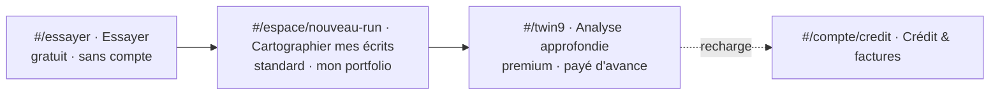

### 3.3 Champ de vision **par persona** dans l'IA cible (reste additif & léger)

```mermaid
flowchart TD
  subgraph VIS["Visiteur"]
    direction LR
    vi["Découvrir"]
  end
  subgraph APP["Apprenant"]
    direction LR
    ap1["Découvrir"] --- ap2["Ma cartographie"] --- ap3["Mon compte"]
  end
  subgraph CARv["+ Cartographe"]
    direction LR
    ca1["…"] --- ca2["Encadrer et garantir"]
  end
  subgraph ETAB["+ Établissement"]
    direction LR
    et1["…"] --- et2["Piloter mon organisation"]
  end
  subgraph PROMv["+ Promptologue / Épistémiarque"]
    direction LR
    pr1["…"] --- pr2["Faire évoluer"]
  end
  subgraph ADMv["+ Admin"]
    direction LR
    ad1["…"] --- ad2["Administrer"]
  end
```

> Lecture : chaque rôle **ajoute une seule famille d'intention** à la barre, nommée par le **but**.
> Un cartographe voit `Découvrir · Ma cartographie · Encadrer & garantir · Mon compte` — sa tâche
> n°1 (« Ma file de relecture ») est nommée dès le niveau 1, plus enterrée en 4ᵉ position.

### 3.4 Avant / après (niveau 1)

| Avant | Après |
|---|---|
| 2 familles : Découvrir / Mon travail (fourre-tout) | 7 familles **par intention**, role-additives |
| Rôles empilés pêle-mêle dans « Mon travail » | 1 famille = 1 but ; l'entrée du rôle est **nommée par sa tâche** |
| « Lancer un run », « Espace cartographe », « Twin_v9 » (objets/rôles) | « Cartographier mes écrits », « Ma file de relecture », « Analyse approfondie » (buts) |
| Portfolio, formation, crédit **dupliqués** ou **nichés** | portfolio = étape ; formation = 1 domicile ; crédit = promu + contextualisé |
| Employeur & épistémiarque **sans domicile** | employeur = vue partagée assainie ; épistémiarque = « Faire évoluer » |

---

## 4. Vers la table des matières interactive (SVG cliquable)

Le graphe §3.1 est **prêt pour la conversion** : chaque nœud a pour ID sa route hash. En mermaid,
il suffit d'ajouter des liaisons `click` pour obtenir un SVG dont **chaque nœud est un lien** :

```text
click c_run "https://humanome.xyz/#/espace/nouveau-run" _self
click e_file "https://humanome.xyz/#/cartographe" _self
…un click par feuille…
```

En production (sur humanome.xyz), on utilisera des **hrefs relatifs** (`#/espace/nouveau-run`)
pour rester en interne au routeur hash. Deux pistes d'implémentation :

1. **Rendu mermaid + `click`** : mermaid génère les `<a>` autour des nœuds ; simple, mais style limité.
2. **SVG maison** (recommandé à terme) : exporter le graphe, envelopper chaque nœud dans un
   `<a href="#/…">`, et surligner le nœud de la **route courante** (`aria-current`) — la TOC devient
   un vrai plan du site, cohérent avec le panneau burger (qui EST déjà ce plan, §5).

Un **prototype interactif** rendant ce graphe avec nœuds cliquables est fourni séparément (Artifact).

---

## 5. Le menu burger (déjà implémenté)

Modifié : `web/src/App.jsx` et `web/src/styles/global.css`. Comportement (vérifié au navigateur,
14 tests verts, 0 erreur console) :

- **Web + mobile** : la barre ne porte plus que la marque (gauche) et, à droite, l'aide « ? » et un
  **bouton « ☰ Menu »**. La navigation vit dans un **panneau déroulant** ancré en haut à droite,
  groupé par famille avec intertitres (`DÉCOUVRIR`, `MON TRAVAIL`, `COMPTE`).
- **Desktop** : le panneau se **révèle au survol** de la zone droite (`@media (hover: hover)`), et
  se **fige au clic** (état épinglé). Un délai de grâce évite que le trou bouton↔panneau ou la barre
  de défilement ne le referme.
- **Mobile** : le panneau s'ouvre **au tap** (pas de survol sur `hover: none`, conforme à la demande).
- **Accessibilité** (au-delà de la demande, pour ne pas exclure le clavier / lecteur d'écran) :
  bouton `aria-expanded` / `aria-controls`, ouverture aussi **au focus clavier**
  (`.app-nav-panel:focus-within`), **Échap** ferme et rend le focus au bouton, clic extérieur ferme.
  Aucun `hidden`/`aria-hidden` : les liens restent dans le DOM et l'ordre de tabulation ; le masquage
  est purement visuel (`opacity` + `pointer-events`) — donc tabuler dans la nav la **révèle**.

Le panneau est, tel quel, la **première brique** de la TOC interactive : il suffira d'y injecter le
regroupement par **intention** de §3.1 (aujourd'hui il reflète encore les 2 familles historiques).

---

## 6. Annexe — relevé du code

Le relevé exhaustif de l'architecture actuelle (routes, sous-sections, sous-nav, personas) ayant
servi de base à cette analyse est archivé dans le scratchpad de session
(`architecture-actuelle.md`). Sources de vérité dans le dépôt : `web/src/nav.js`,
`web/src/router.js`, `web/src/App.jsx`, `web/src/help/registry.js`, `web/src/views/*`,
`web/src/views/espace/formation-content.js`.
